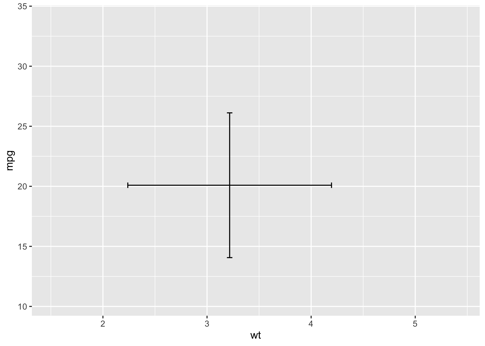
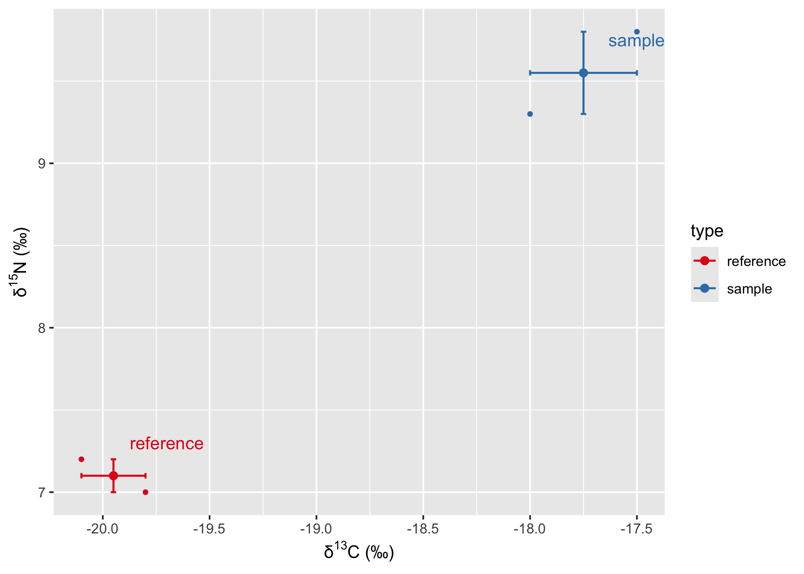
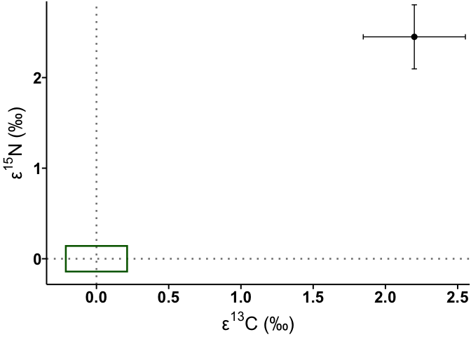

# README


## ggbotbar

Create plot with geom_errorbar + geom_errorbarh with constant cap width.

## Usage

Load packages.

``` r
library(tidyverse)
library(ggbothbar)

packageVersion("ggbothbar")
```

    [1] '1.0.1'

``` r
library(ggplot2)
ggplot(mtcars, aes(x = wt, y = mpg)) +
  geom_errorbarb()
```



## Isotopic data workflows

The package includes helpers for mycoheterotrophic isotopic data. Start
from replicate measurements, calculate enrichment, then visualise
group-level uncertainty along both axes.

``` r
iso_raw <- tibble::tribble(
  ~type,       ~d13c, ~d15n,
  "reference", -20.1,   7.2,
  "reference", -19.8,   7.0,
  "sample",    -17.5,   9.8,
  "sample",    -18.0,   9.3
)

iso_enriched <- calc_enrichment(iso_raw, delta = c("d13c", "d15n"))
iso_enriched
```

    # A tibble: 4 × 5
      type       d13c  d15n   e13c    e15n
      <chr>     <dbl> <dbl>  <dbl>   <dbl>
    1 reference -20.1   7.2 -0.150  0.100 
    2 reference -19.8   7    0.150 -0.1000
    3 sample    -17.5   9.8  2.45   2.7   
    4 sample    -18     9.3  1.95   2.20  

### Error bars in both directions

`geom_errorbarb()` summarises each group into cross-shaped error bars.
Supply a grouping aesthetic so replicates for the same taxon or
treatment are combined.

``` r
ggplot(
  iso_enriched,
  aes(d13c, d15n, colour = type, group = type)
) +
  geom_point(size = 1) +
  stat_mean_point(size = 2) +
  geom_errorbarb(fun.errorbar = "se", linewidth = 0.6, errorbar_tip_size = 1.2) +
  scale_colour_brewer(palette = "Set1") +
  labs(x = label_isotope(13, "C"), y = label_isotope(15, "N"))
```



### Enrichment factor with Error boxes

``` r
ggplot() +
  geom_hline(yintercept = 0, linetype = "dotted", colour = "grey50") +
  geom_vline(xintercept = 0, linetype = "dotted", colour = "grey50") +
  stat_mean_point(
    data = filter(iso_enriched, type != "reference"),
    mapping = aes(x = e13c, y = e15n),
    size = 2
  ) +
  geom_errorbarb(
    data = filter(iso_enriched, type != "reference"),
    mapping = aes(x = e13c, y = e15n),
    fun.errorbar = "sd"
  ) +
  geom_errorbox(
    data = filter(iso_enriched, type == "reference"),
    mapping = aes(x = e13c, y = e15n),
    fill = NA,
    fun.errorbar = "sd",
    colour = "darkgreen"
  ) +
  labs(x = label_isotope(13, "C", "epsilon"), y = label_isotope(15, "N", "epsilon")) +
  theme_aca(base_family = "Arial")
```


